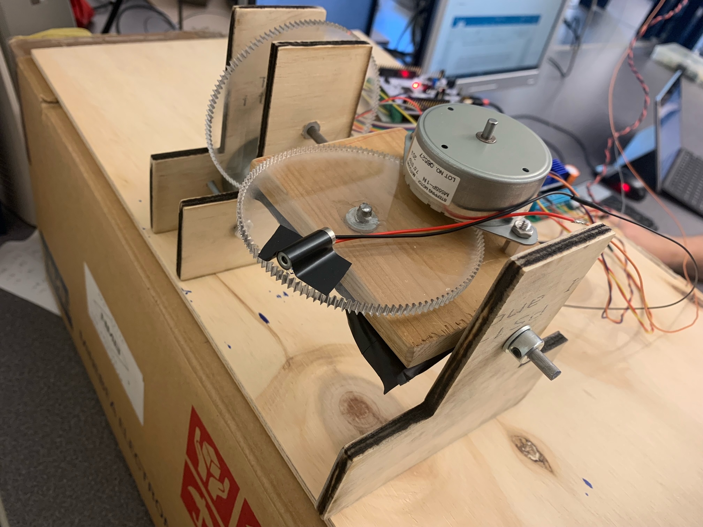
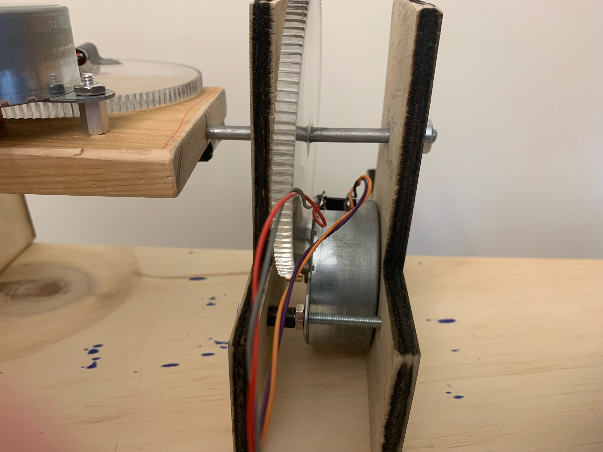
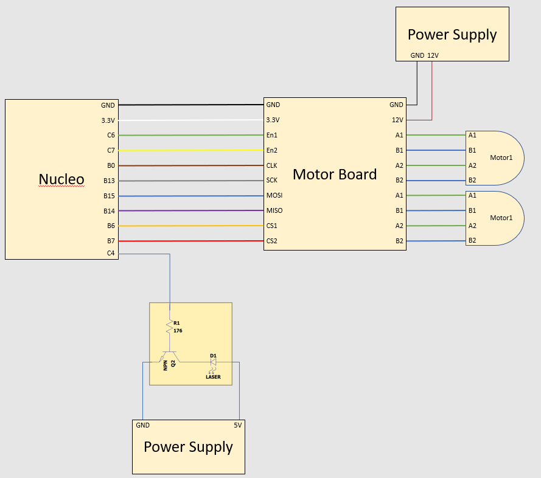
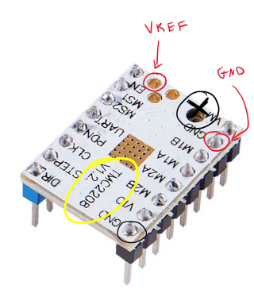
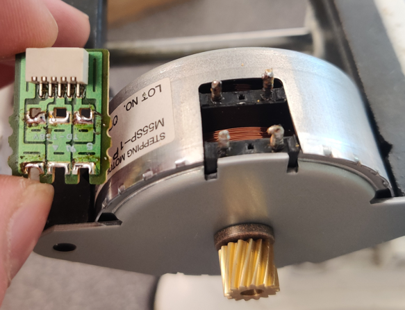
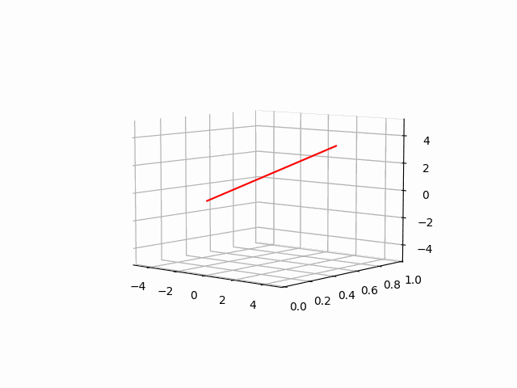
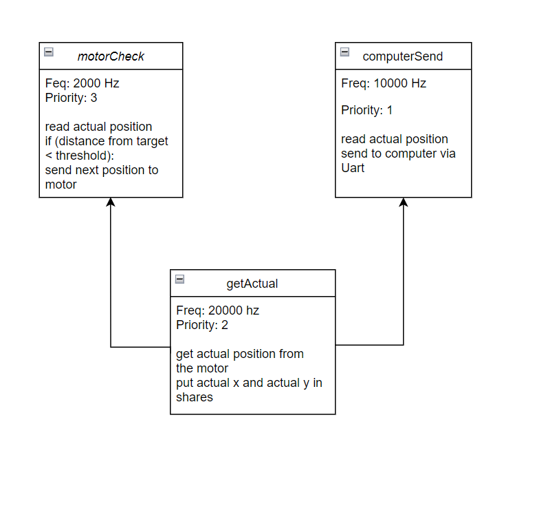
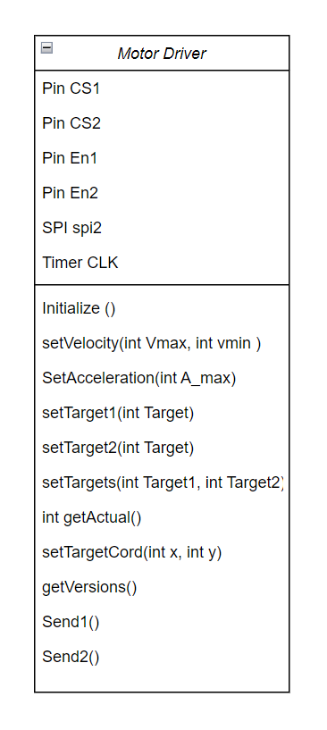

# ME-405-LASER-TRACER
## Created by Jake Souto and Harrison Power
  
###### Project:
  The objective for this project was to create a 2½ degree pen plotter with the challenge of making both dimensions non-linear. For our project we chose to control a laser pointer across two radial dimensions taking a long exposure photo of the laser path to “record the drawing”. In addition to this, we plot the curve that the machine is drawing on the computer in real time. Below is our final design as well as some of the drawing we made with it.
  

  
  

   

    
  
 
  
  
  
###### Chassis:
  The chassis of our machine is functional for its purpose but has room for improvements. The supports of our chassis are laser cut wooden T’s which holds the vertical motor and the axles for the gears and platform. The acrylic laser cut gears are fundamental to this project as they gear up our stepper motor 10-1 allowing us to achieve a resolution of 120x120 steps and greatly increase our torque. The laser cut file for the gears are avalible in our repository [here](gear.DXF). The resulting shakiness visible in our final images stem from our chassis as the T supports are not fully stable and our laser cut gears don’t perfectly mesh with the metal stepper gears.
  

   
  
 
  

###### Hardware:
The Board we used for this project is a Nucleo L476RG which interfaced serially with a TMC 4210 stepper motor IC, which gave commands to the TMC 2208 motor driver. The TMC 4210 and the TMC 2208 were pre-assembled on a custom PCB board which handled the connections between the two devices. The Nucleo was connected to this board and the motors as shown in the diagram below. 

   
  

The TMC 2208 chips had an on board current limiting potentiometer that we had to adjust manually. This was set by measuring the voltage across the vref pin and ground, and adjusting the potentiometer until the voltage read 0.7 V. The motors we used were 48 step per rotation / 7.5 degree per step four wire stepper motors. We unsoldered the circuit on the face of the motor to manually solder wired directly to the pins to more easily interface with the motors.

   
  

 

###### Movement Calculations:
To convert the x,y coordinates to radial coordinates that we could write to our stepper motors we used what is called the Newton-Raphson algorithm. This algorithm consecutively approximates any given solution to an equation using the formula below. 

$$\begin{equation}
\frac{df^{-1}}{dθ} = 
  \begin{bmatrix}
    \frac{1}{rsec^2(θ1)} & 0 \\
    0 & \frac{1}{rsec^2(θ2)}
  \end{bmatrix}
\end{equation}$$

$$\begin{equation}
x_{n+1} =  x_n - 
  \begin{bmatrix}
    \frac{1}{rsec^2(θ1)} & 0 \\
    0 & \frac{1}{rsec^2(θ2)}
  \end{bmatrix}
  \begin{bmatrix}
    rtan(θ1)\\
    rtan(θ2)
  \end{bmatrix}
\end{equation}$$

This equation iterated through until the difference between the next step and the current one is less than some threshold; we know that the calculated thetas correspond to the desired x,y coordinates. Implementing this function into python and generating thetas for a simple circle we were able to generate this gif to prove that our equation was correct for our implementation. 

   
  

###### Code:
The main executable for our project is [Wrapper.py](Wrapper.py). Wrapper.py reads the hpgl file, deconstructs the instructions into a set of coordinates, runs each coordinate through the Newton-Raphson, interpolates the data, and initializes the tasks all upon start-up. There are three tasks: getActual() updates a share with the actual position of the motor received from the TMC4210, motorCheck() evaluates if a new location should be sent based on if the current position matches the target location and computerSend() which sends the actually position of the stepper to the computer to graph in real time. The tasks are outlined in the left figure below.

   
  
 
  
The [StepperClass.py](StepperClass.py) is a library of the Stepper class which initializes and communicates to the TMC4210 chip. A single instantiation of the Stepper is able to communicate to control two motors which is documented above in the image on the right. In order to get the stepper motors to move many of the TMC registers needed to be initialized as detailed in the datasheet for the TMC4210. Some of the values in the register are concretely defined needing to be set to certain values in order to function. However, some registers controlled internal settings that varied depending on the implementation notably, the speed settings. All of the presets we used can be found in our StepperClass.py.

The [Bell.py](Bell.py) is a separate executable to be run on an external computer not the Nucleo. This file reads the serial port connected to the Nucleo and receives the actual motor position. It decodes the serial communication into (x,y) coordinates and creates and updating graph that traces the coordinates in real time.

###### Instructions:
Setup the device facing a wall with ample space below and above the machine. Ensure the laser is pointing appropriately in the center of the Canvas then turn on the power supply to the stepper motors. Apply 5V to the laser pointer circuit and the hardware is set up.

For the software download the code from the git repository. There are three important programs, StepperClass.py, Wrapper.py, cotask.py, task_share.py and Bell.py. The Bell.py file stays on the computer while all of the other files will be installed via Thonny onto the Nucleo. Additionally, an hpgl file of the desired path should be installed onto the Nucleo as well. Once all the files are installed, edit Wrapper to ensure that it correctly opens the desired hpgl file. Connect the Nucleo to the desktop and run the Bell.py program (make sure it has the correct com port for your computer) which will wait for the serial input from the Nucleo. Run the Wrapper.py file from the Nucleo and the machine will begin to draw the path and update the live tracker on the computer.

###### Reflection:
If we were to undertake this project again we would improve upon a few things. Primarily the major restraint keeping us from drawing very clean lines is the chassis. The chassis design was not sturdy and allowed the whole device to vibrate and shake. The gears being of a laser cut material ended up a little smaller than the CAD drawing preventing the gear from meshing perfectly with the motor gear. Overall this oversight allowed our machine to vibrate during operation causing the shakiness seen in the final drawings.

On the software side a large issue encountered by many teams was a memory error. This was caused by the interpolated Newton- Raphson taking up too much of the Nucleo’s memory, causing it to crash. If we did this again we would store and calculate all of the coordinate points on a computer and send individual coordinates to the Nucleo allowing us to run very large images with a high level of accuracy. 
