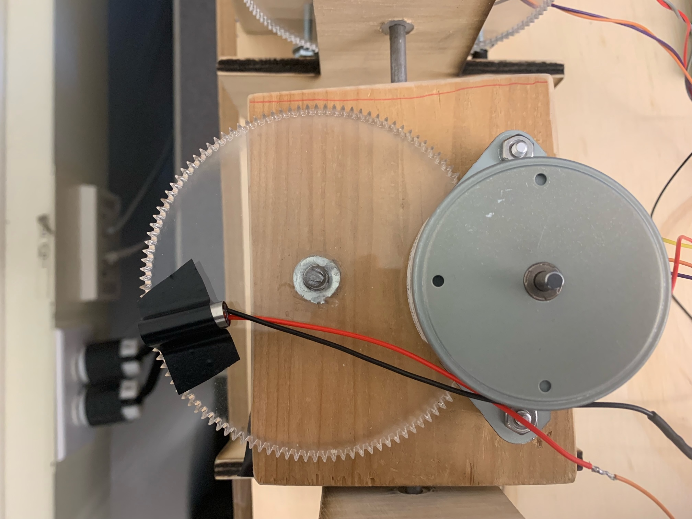

# ME-405-LASER-TRACER
## Created by Jake Souto and Harrison Power

###### Background
  The objective for the class was to create a 2½ degree pen plotter with the challenge of making both dimensions non-linear. For our project we chose to use control a laser pointer across two radial dimensions taking a long exposure photo of the laser path to “record the drawing”.
###### Project
  Our finished project achieved the goals of the assignment able to draw polygonal shapes and curves. Below are reference photos of some of the laser artwork we were able to create with our device.
  
  
###### Chasis
  The chassis of our machine is functional for its purpose but has room for improvements. The supports of our chassis are laser cut wooden T’s which holds the vertical motor and the axles for the gears and platform. The acrylic laser cut gears are fundamental to this project as they gear up our stepper motor 10-1 allowing us to achieve a resolution of 120x120 steps and greatly increase our torque. The resulting shakiness visible in our final images stem from our chassis as the T supports are not fully stable and our laser cut gears don’t perfectly mesh with the metal stepper gears. If we were to improve upon this design, a sturdier and more precise chassis would improve the final product significantly. 
  

###### Harware

###### Code
